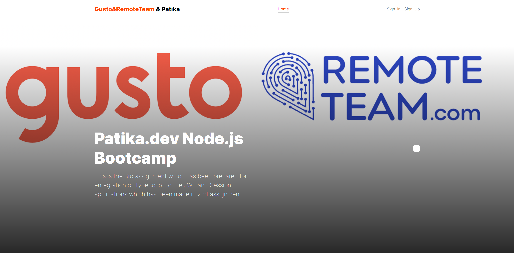
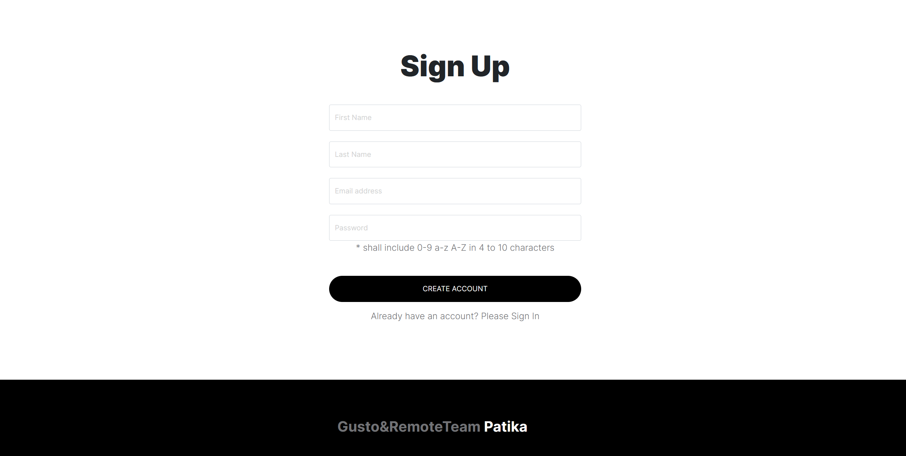
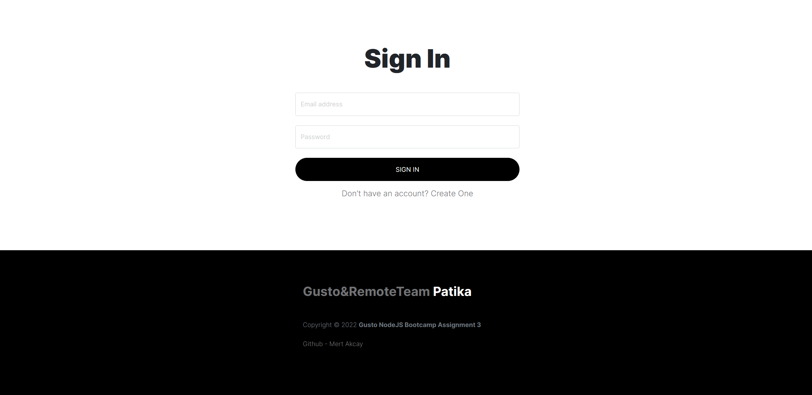

# Gusto&RemoteTeam Bootcamp Assignment-4
### This is the 4th assignment which has been prepared for entegration of MySQL and Typeorm to the TypeScript project that has been made last week.
### Main goal of this assignment are entegration of: 
- MySQL for database
- Typeorm for ORM tool

### All required database connection configuration is made in 'ormconfig.json'

 
 

## '.env' file is shared intentionally just for evaluation process

 

 

### In every login, user's ID and browser info is stored in session and a JWT Token. This token and session ID returns to the client with cookies. 
### After this process, every authentication-required operation can be done after comparison of browser infos and userIDs in Session, JWT and Request(cookies) 

 
 

## Home Page

## Sign-up Page

## Sign-in Page

## Users Page
